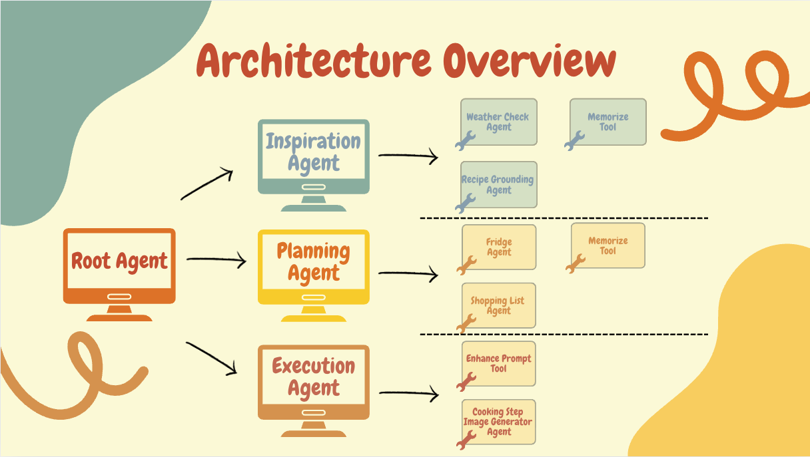

# ByteMyMood
Where your feelings feed the recipe.

## Overview
ByteMyMood is an intelligent recipe recommendation system that uses a multi-agent architecture to understand your mood and preferences, plan meals, and execute cooking instructions.

## Features
- **Mood-based recipe recommendations** - AI understands your emotional state
- **Weather-aware suggestions** - Considers current weather conditions
- **Personalized cooking plans** - Adapts to your preferences and skills
- **Visual cooking guidance** - AI-generated images for each step
- **Smart shopping lists** - Paper-like format organized by store sections
- **Equipment verification** - Ensures you have the right tools
- **Robust error handling** - Retry logic for API failures
- **User profile management** - Persistent preferences and mood tracking
- **Recipe verification** - Ensures all suggestions are real and accessible

## Architecture
The system is built on a multi-agent architecture with three specialized sub-agents:



### 1. Inspiration Agent
- Analyzes user's mood and preferences
- Generates creative recipe ideas
- Considers dietary restrictions and preferences
- Integrates weather data for contextual suggestions
- Verifies recipes through web search
- Located in `bytemymood/sub_agents/inspiration/`

**Tools & Agent-tools:**
- **Weather Check Agent**: Uses `weather_api_tool` to get current weather conditions
- **Recipe Grounding Agent**: Uses `google_search_grounding` to verify recipe authenticity
- **Memory Tools**: `memorize` for storing user preferences and mood data

### 2. Planning Agent
- Breaks down recipes into manageable steps
- Creates detailed cooking plans
- Generates shopping lists
- Analyzes available ingredients from fridge photos
- Verifies kitchen equipment requirements
- Located in `bytemymood/sub_agents/planning/`

**Tools & Agent-tools:**
- **Fridge Agent**: Analyzes available ingredients using `memorize` and `memorize_list`
- **Shopping List Agent**: Generates organized shopping lists using `memorize` and `memorize_list`
- **Memory Tools**: `memorize` and `memorize_list` for tracking ingredients and lists

### 3. Execution Agent
- Provides step-by-step cooking instructions
- Generates visual aids for each cooking step
- Handles real-time adjustments
- Manages cooking process
- Located in `bytemymood/sub_agents/execution/`

**Tools:**
- **Image Generation**: `gemini_image_generation_tool` for creating cooking step visuals
- **Prompt Enhancement**: `prompt_enhance_tool` for optimizing image generation prompts
- **Memory Tools**: `memorize` and `memorize_list` for tracking cooking progress

### Shared Tools & Infrastructure
- **Memory System** (`memory.py`): User profile management and conversation state
- **Weather API** (`weather.py`): Real-time weather data with retry logic
- **Search API** (`search.py`): Recipe verification and web search capabilities
- **Image Generation** (`image_generation/`): Google Gemini-powered visual cooking aids

## Installation Flow

### Step-by-Step Setup

#### 1. Clone and Navigate
```bash
git clone <repository-url>
cd ByteMyMood
```

#### 2. Install uv Package Manager
```bash
# macOS/Linux
curl -LsSf https://astral.sh/uv/install.sh | sh

# Or using pip
pip install uv
```

#### 3. Set Up Virtual Environment and Dependencies
```bash
# Create virtual environment and install all dependencies
uv sync

# Install project in editable mode
uv pip install -e .
```

#### 4. Configure API Keys
Create a `.env` file in the project root:
```bash
# Create .env file
touch .env
```

Add your API keys to `.env`:
```env
GOOGLE_API_KEY=your_google_api_key
GOOGLE_GEOCODING_API_KEY=your_geocoding_key
GOOGLE_WEATHER_API_KEY=your_weather_key
```

#### 5. Authenticate Google Cloud
```bash
# Install Google Cloud CLI if not already installed
# https://cloud.google.com/sdk/docs/install

# Authenticate your account
gcloud auth application-default login
```

### Running ByteMyMood

#### Command Line Interface
```bash
# Start ByteMyMood CLI
uv run adk run bytemymood
```

#### Web Interface
```bash
# Launch web interface
uv run adk web
```

## Project Structure
```
bytemymood/
├── agent.py                    
├── prompt.py                   
├── sub_agents/                
│   ├── inspiration/         
│   │   ├── agent.py         
│   │   └── prompt.py         
│   ├── planning/            
│   │   ├── agent.py        
│   │   └── prompt.py         
│   └── execution/            
│       ├── agent.py         
│       └── prompt.py         
├── tools/                    
│   ├── memory.py             
│   ├── weather.py            
│   ├── search.py             
│   └── image_generation/     
│       ├── image_generation.py      
│       └── image_generation_prompt.py 
├── profiles/                  
│   ├── user_profile_default.json           
│   ├── user_profile_example.json           
│   └── user_profile_example_with_recipe.json 
├── shared_libraries/         
│   ├── constants.py         
│   └── types.py              
└── tests/                    
    └── unit/                 
        ├── test_agents.py    
        ├── test_tools.py     
        ├── test_profile.py   
        ├── test_image_generation.py 
        └── test_weather_api.py 
```

## License
See [LICENSE](LICENSE) for details.
